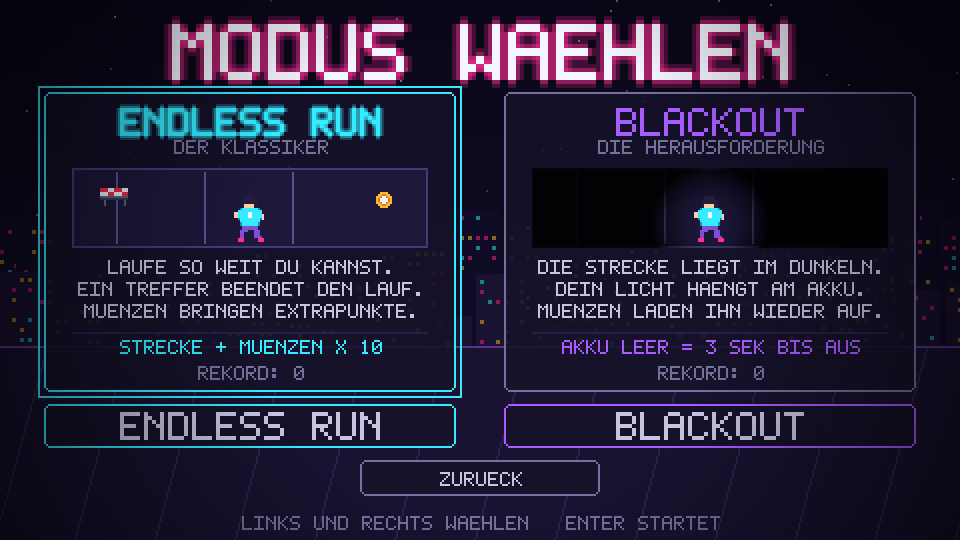

# NEON RUSH

Ein Pixel-Endless-Runner mit PyGame im Stil von Subway Surfers, in einer
Neon-Nacht-Optik. Drei Spuren, automatisch laufende Figur, Hindernissen wird
durch Springen, Rutschen und Spurwechsel ausgewichen.



## Start

```bash
pip install -r requirements.txt
python main.py
```

Getestet mit Python 3.11 und PyGame 2.6.

Das Spiel laesst sich **jederzeit mit ESCAPE oder dem Kreuz-Button** schliessen –
auch mitten im Spiel und bei offenem Pop-up.

## Steuerung

| Taste | Wirkung |
|---|---|
| `←` `→` | Spur wechseln |
| `↑` / `Leertaste` | Springen (Huerden) |
| `↓` | Rutschen (haengende Balken) |
| `P` | Pause |
| `M` | Ton an/aus |
| `F11` | Vollbild |
| `ESC` | Spiel sofort beenden |

Alle Menues sind sowohl per Maus als auch per Tastatur bedienbar.

## Die zwei Spielmodi

**ENDLESS RUN** – Der Klassiker. Ein Treffer beendet den Lauf. Muenzen sind
freiwillig und bringen Punkte.
`Punkte = Strecke + Muenzen × 10`

**BLACKOUT** – Der zweite Modus, funktionell klar unterschieden. Die Strecke
liegt im Dunkeln, nur ein Lichtkegel ist sichtbar. Dieser Kegel haengt an einem
**Akku, der stetig leerer wird** – und mit ihm schrumpft die Sichtweite.
**Muenzen sind hier keine Punkte, sondern Akkuladung.** Ist der Akku leer,
bleiben drei Sekunden Blindflug, dann ist der Lauf vorbei.

Der Unterschied ist nicht nur optisch: Es gibt eine **zweite Verlustbedingung**,
die es im ersten Modus gar nicht gibt, und die Risikologik kehrt sich um – aus
optionalem Einsammeln wird Ueberlebenspflicht.

## Projektstruktur

```
main.py                  Startpunkt, meldet alle Screens an
requirements.txt
game/
  config.py              Konstanten, Farbpalette, Einstellungs-Persistenz
  pixelfont.py           Eigene 5x7-Bitmap-Schrift, komplett im Code
  sprites.py             Alle Grafiken, prozedural gezeichnet
  audio.py               Klangsynthese: Effekte und zwei Musikstuecke
  ui.py                  Buttons, Schieberegler, Pop-ups, Toasts
  scene.py               Fenster, Skalierung, Szenenverwaltung, Hauptschleife
  entities.py            Spielfigur, Hindernisse, Muenzen, Level-Generator
  highscore.py           Bestenliste, getrennt nach Modus
  scenes/
    base.py              Gemeinsame Grundlage der Menue-Screens
    menu.py              Startscreen
    modes.py             Modusauswahl
    howto.py             Anleitung (drei Kapitel)
    audio_screen.py      Musik- und Tonsteuerung
    scores.py            Bestenliste
    play.py              Gamescreen, beide Spielmodi
    gameover.py          Endscreen
```

Zur Laufzeit entstehen ausserdem `settings.json` und `highscores.json`.

## Technische Besonderheiten

**Keine externen Dateien.** Das Projekt kommt ohne eine einzige Bild-, Schrift-
oder Audiodatei aus. Alles wird beim Start im Code erzeugt:

- **Eigene Pixelschrift** – jeder Buchstabe ist ein von Hand gezeichnetes
  5×7-Pixelraster in `pixelfont.py`.
- **Prozedurale Sprites** – Spielfigur (vier Zustaende, animierter Lauf),
  Hindernisse und Extras als Textraster in `sprites.py`; Skyline und Sterne
  werden mit festem Zufalls-Seed generiert.
- **Synthetisierter Chiptune-Sound** – zehn Effekte und zwei Musikstuecke aus
  Rechteck-, Dreieck- und Rauschsignalen mit ADSR-Huellkurve.

**Virtuelle Aufloesung.** Gezeichnet wird auf eine 480×270-Flaeche, die erst
zum Schluss hochskaliert wird. Daher harte Pixelkanten und ein Vollbildmodus,
der auf jedem Monitor ohne Layoutaenderung funktioniert.

**Perspektive.** Die Strasse wird zeilenweise gezeichnet: zu jeder Bildzeile
wird die passende Tiefe zurueckgerechnet. Dadurch sind die Spurlinien
lueckenlos statt treppenfoermig.

## Erfuellte Kriterien der Wegleitung

| # | Kriterium | Umsetzung |
|---|---|---|
| 1 | Startscreen mit Start- und weiteren Buttons | `scenes/menu.py`, fuenf Buttons |
| 2 | Anleitungs- und Musiksteuerungs-Screen inkl. Mute | `scenes/howto.py` (3 Kapitel), `scenes/audio_screen.py` |
| 3 | Gamescreen mit eigenen akustischen und visuellen Elementen | `scenes/play.py`, alle Grafiken und Klaenge selbst erzeugt |
| 4 | Endscreen mit mind. zwei Aktionen | `scenes/gameover.py`, fuenf Aktionen |
| 5 | Screens verknuepft, `main.py`, ESC und Kreuz schliessen jederzeit | `scene.py`, Behandlung vor allem anderen |
| 6 | Vollbildmodus und sinnvoller Highscore | `F11`, `highscore.py` – getrennt pro Modus |
| 7 | Persoenlicher Anstrich, eigene Schrift | `pixelfont.py`, `sprites.py`, `audio.py` |
| 8 | Eigener zweiter Spielmodus | Blackout mit Akku-Mechanik |

Zusaetzlich: Pop-up-System (Pause, Beenden-Abfrage, Rekordmeldung, Countdown,
Power-Up-Einblendungen), Power-Ups (Magnet, Schild, doppelte Muenzen),
Partikeleffekte und Bildschirmwackeln.

## Quellenangaben

Der gesamte Code ist eigenstaendig geschrieben. Es wurden **keine
Codefragmente aus Tutorials uebernommen** und keine externen Bild-, Schrift-
oder Audiodateien eingebunden. Die Quellenangaben stehen zusaetzlich am Anfang
jeder Python-Datei.

Verwendete Bibliotheken:

- **PyGame** – Spielebibliothek, <https://www.pygame.org/docs/>
- **NumPy** – Zahlenfelder fuer die Klangsynthese, <https://numpy.org/doc/>

Das Spielprinzip ist vom Endless-Runner-Genre inspiriert (bekannt durch Subway
Surfers und Temple Run). Die Umsetzung erfolgte ohne Vorlage.

**KI-Einsatz:** Dieses Projekt wurde zusammen mit Claude (Anthropic) als
Programmierhilfe entwickelt. Fuer eine Abgabe nach Wegleitung waere dieser
Einsatz in den Logfiles in der dort vorgegebenen Tabellenform aufzuschluesseln
(KI-Tool, Einsatzform, betroffene Teile des Codes, Bemerkungen).

## Hinweis

Dies ist ein Uebungsprojekt und **keine offizielle Abgabe**. Fuer eine Abgabe
nach Wegleitung fehlen: ausgefuellte Projektskizze, Logfiles 01–03,
Arbeitsplan mit Aufgabenteilung, Actionvideo und die vorgeschriebene
Snake-Case-Benennung der Abgabedateien.

## Browser-Fassung

Unter `web/index.html` liegt zusaetzlich eine Browser-Version des Spiels in
HTML und JavaScript. Sie laeuft ohne Installation auf Tablet, Handy und
Laptop und enthaelt gegenueber der PyGame-Fassung zusaetzlich:

- **Punch-Mechanik** (`X` oder antippen) mit Abklingzeit: Kisten und Drohnen
  lassen sich zerschlagen, alles andere nicht. Zerschlagbares ist gruen
  umrandet.
- **Gluecksrad**: Fuer 100 Coins drehen und Skins, Power-Ups, Revives oder
  Coins gewinnen. Acht gleich grosse Felder, die Anzeige entspricht also
  genau den Gewinnchancen.
- **Sechs Skins** fuer die Spielfigur, rein kosmetisch.
- **Unbegrenzte Beschleunigung**: Das Tempo hat keine Obergrenze. Der
  Hindernisabstand skaliert mit, damit die Reaktionszeit konstant bleibt.
- **Fuenf Power-Ups**: Magnet, Schild, doppelte Coins, Zeitlupe, Boost.
- **Touch-Steuerung**: Wischen zum Ausweichen, Tippen zum Punchen.

Fortschritt (Coins, Skins, Highscores) wird lokal gespeichert und ueber die
Artifact-Datenablage zusaetzlich geraeteuebergreifend synchronisiert.

Die Musik ist wie in der PyGame-Fassung synthetisiert. In `web/index.html`
steht oben `AUDIO_FILES` - traegt man dort eigene Musik als data-URI ein,
wird diese statt der synthetisierten Musik verwendet.

Hinweis: Die Browser-Fassung erfuellt die Wegleitung NICHT, die
ausdruecklich PyGame und ein `main.py` verlangt. Sie ist zum Ausprobieren
und Zeigen gedacht; abgabetauglich ist die PyGame-Version im Wurzelverzeichnis.
